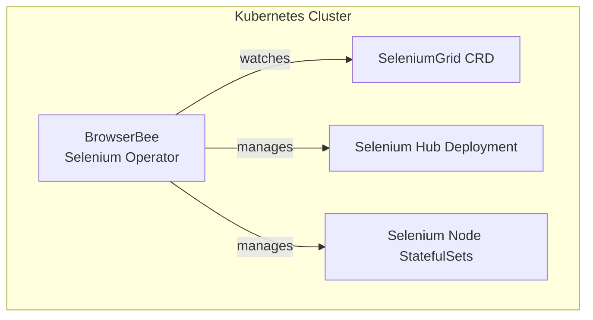

# Overview

[](https://github.com/browserbee/browserbee-selenium-operator/releases)
[](LICENSE)
[](https://join.slack.com/t/browserbee/shared_invite/xyz)

**BrowserBee Selenium Operator** is a Kubernetes‑native solution that lets you **define, deploy, and scale Selenium Grid resources using Custom Resource Definitions (CRDs)**. Manage your browser‑automation infrastructure the same way you manage the rest of your cloud‑native stack—declaratively, version‑controlled, and GitOps‑friendly.

Whether you are experimenting locally or orchestrating hundreds of parallel test sessions in production, this documentation will guide you from first cluster to advanced tuning.

---

## Why BrowserBee Selenium Operator?

| Challenge | Traditional Approach | Operator Advantage |
|-----------|---------------------|--------------------|
| **Environment drift** | Hand‑crafted YAML or imperative `kubectl` commands | Declarative CRDs version‑controlled in Git |
| **Upgrades & scaling** | Manual image bumps and replica tweaks | Reconciliation loop keeps desired state |
| **Developer onboarding** | Tribal knowledge & runbooks | One‑liner `kubectl apply` installs Grid |
| **Multi‑cluster adoption** | Re‑implement configs per cluster | Re‑use the same CRDs everywhere |

> **DX Tip 🛠️**  
> Store your CRDs in the same repo as your application code and let **Argo CD** or **Flux** apply them automatically. This turns Selenium Grid changes into pull‑request reviews, CI checks, and instant rollbacks.

---

## Architecture



* The **Operator** reconciles every `SeleniumGrid` CR instance.
* A **Hub** deployment receives session requests.
* One or more **Node** StatefulSets register with the Hub to execute browser sessions.

---

## Quick Start

### Prerequisites
* **kubectl** ≥ 1.25
* **kind** ≥ 0.20 (or any Kubernetes 1.25+ cluster)

### 1 — Create a local cluster
```bash
kind create cluster --name selenium-cluster
```

### 2 — Install the Operator
```bash
kubectl apply -f https://raw.githubusercontent.com/browserbee/browserbee-selenium-operator/main/manifests/install.yaml
```
This installs all components in the `browserbee-selenium-operator-system` namespace.

> **DX Tip 🛠️**  
> Watch the rollout live:  
> `kubectl -n browserbee-selenium-operator-system get pods -w`

### 3 — Spin up a Selenium Grid
```bash
kubectl apply -f https://raw.githubusercontent.com/browserbee/browserbee-selenium-operator/main/manifests/selenium-grid/install.yaml
```

### 4 — Verify
```bash
kubectl get seleniumgrids
kubectl get svc selenium-hub -o jsonpath='{.status.loadBalancer.ingress[0].hostname}'
```
Open the Grid console in your browser and start testing!

---

## Example Manifests

Use the ready‑made samples to get productive in seconds:

| Example | Description |
|---------|-------------|
| [`selenium-grid.yaml`](https://github.com/browserbee/browserbee-selenium-operator/blob/main/examples/selenium-grid.yaml) | Full Selenium Grid with Chrome & Firefox nodes |
| [`selenium-test.yaml`](https://github.com/browserbee/browserbee-selenium-operator/blob/main/examples/selenium-test.yaml) | Kubernetes Job that runs a simple Selenium test |

```bash
kubectl apply -f examples/selenium-grid.yaml
kubectl apply -f examples/selenium-test.yaml
```

> **Productivity Hint 🚀**  
> Parametrize these manifests with **Helm** or **Kustomize** to reuse them across environments.

---

## Features

* **Declarative CRDs** — define Hub, Nodes, browser versions, and autoscaling rules in YAML.
* **Zero‑downtime upgrades** — rolling updates handled by the Operator.
* **Autoscaling** — integrate with the Kubernetes Horizontal Pod Autoscaler.
* **Multi‑version support** — run multiple browser versions side‑by‑side.
* **Metrics & observability** — scrape Prometheus metrics out‑of‑the‑box; dashboards included.
* **Extensible** — add custom node images, sidecars, or plugins via standard Kubernetes patterns.

---

## Next Steps
1. **Helm Chart** — package your Grid and ship it to any cluster.
2. **GitOps** — integrate with Argo CD or Flux for continuous delivery.
3. **CI Integration** — point your test runners to the Grid service endpoint.
4. **Observability** — import the provided Grafana dashboards and alerting rules.

---

## Community & Support
* **Slack**: Join the conversation and get help from maintainers.
* **GitHub Discussions**: Ask questions, propose features, and share tips.
* **Contributing Guide**: PRs welcome! See `CONTRIBUTING.md`.

---
<div align="center" style="font-size:0.9em;margin-top:2rem;">
  Not affiliated with the official SeleniumHQ project.
</div>

